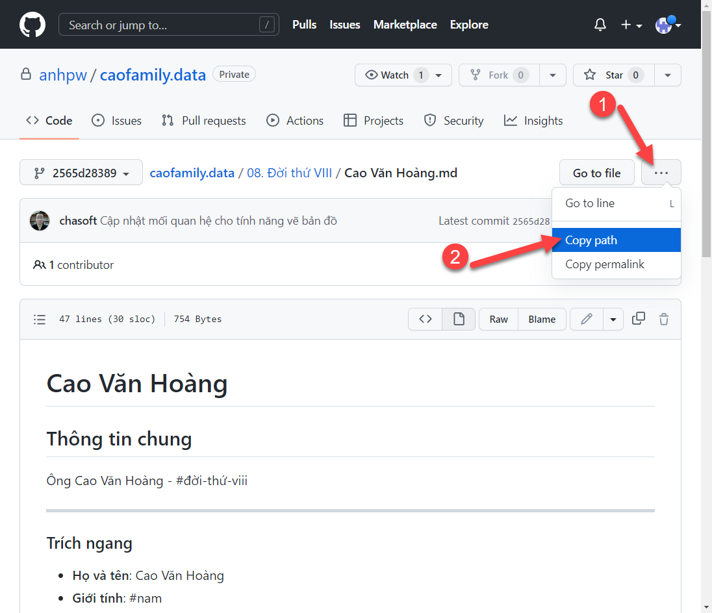
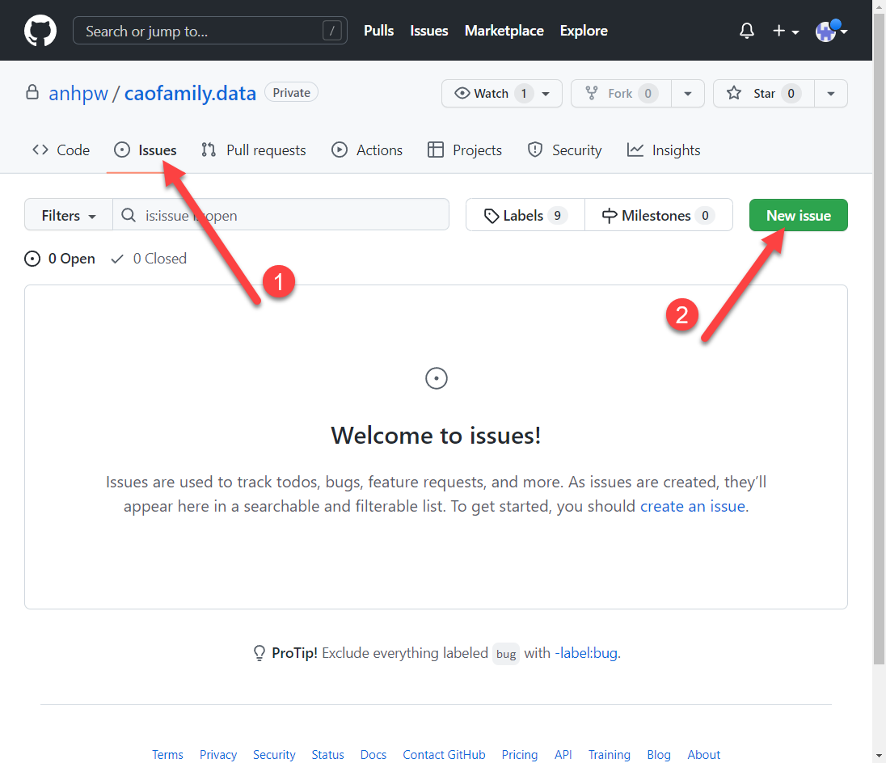
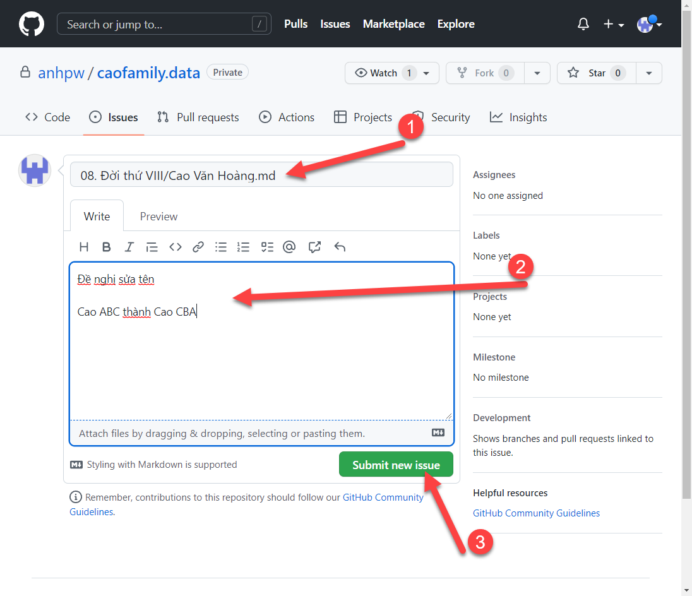
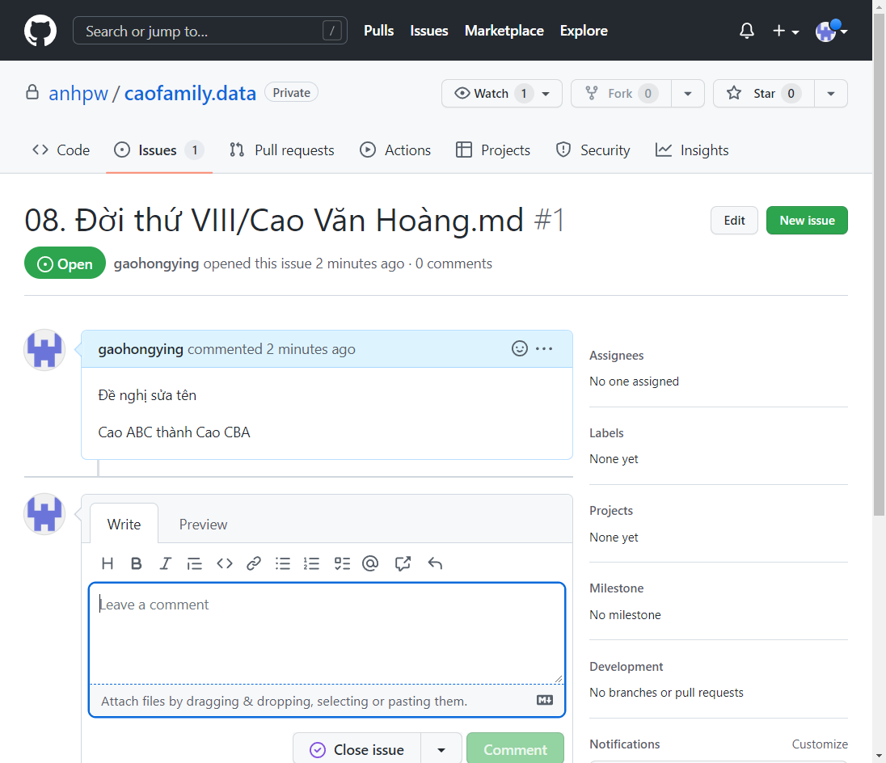
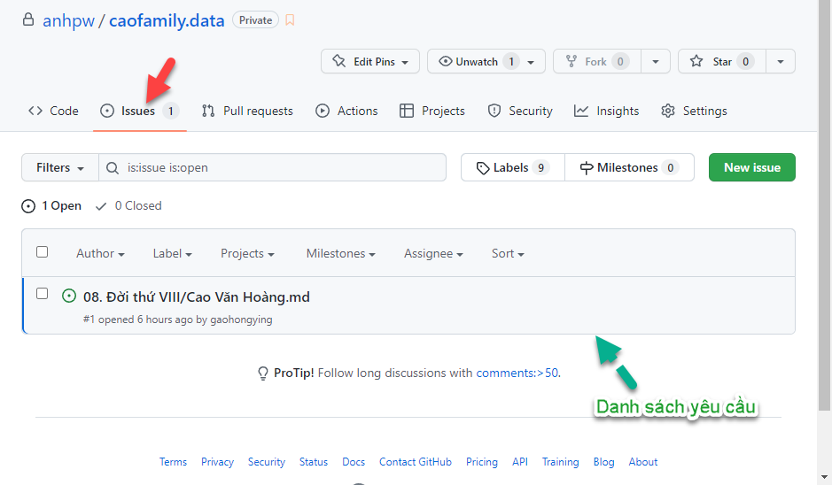
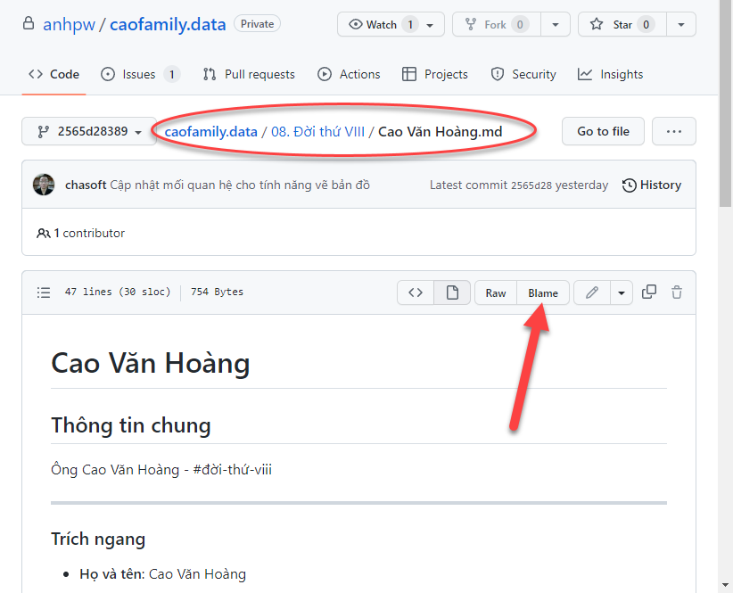
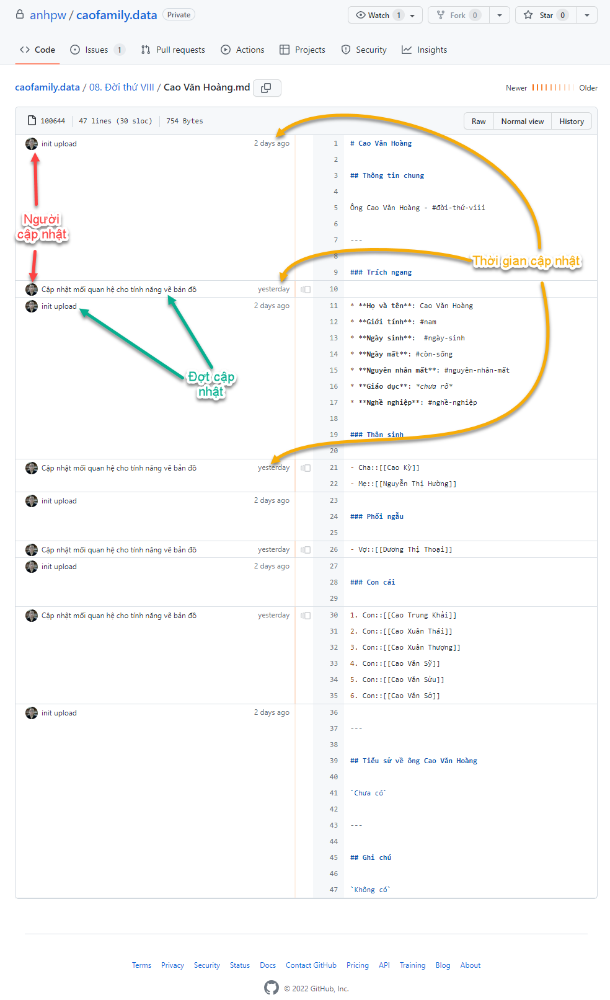

# Cập nhật dữ liệu

Để việc cập nhật dữ liệu mang tính công khai và ghi nhận lịch sử / nguyên nhân / nguồn gốc của thông tin. Cơ chế cập nhật cơ sở dữ liệu Gia phả như sau:

1. Dữ liệu ban đầu, ông `Cao Hồng Anh` sẽ cập nhật từ các nguồn thông tin chính thức lấy từ các nguồn chính thức như từ ông `Nguyễn Cao Cẩm`, ông `Cao Văn Hoàng` hay ông `Cao Thế Vinh`,...v.v.

2. Cơ sở dữ liệu luôn được **`mở`** cho mọi thành viên của tộc họ. Các ông/bà/chú/bác có thời gian rảnh thì kiểm tra và nếu có thêm/bớt/thay đổi/sửa/xóa thông tin thì làm theo hướng dẫn sau:

	- **Bước 1**: **Xác định** nơi cần chỉnh sửa *(trên GitHub tại `https://github.com/anhpw/caofamily.data`)*
	- **Bước 2**: **Mở yêu cầu** chỉnh sửa trên GitHub.

Các hoạt động trên rất đơn giản. Hãy xem hướng dẫn chi tiết tiếp theo bên dưới.

## Xác định nơi cần chỉnh sửa

Truy cập https://github.com/anhpw/caofamily.data, di chuyển đến trang dữ liệu của tộc họ mà cần điều chỉnh/thêm bớt/sửa/xóa thông tin.

**Ví dụ**: Giả sử cần cập nhật lại thông tin của ông **Cao Văn Hoàng** thì chúng ta sẽ vào trang dữ liệu của ông. Nhấp vào nút **[...]** và chọn lệnh **`Copy Path`**

Và dữ liệu copy được nó sẽ là: **`08. Đời thứ VIII/Cao Văn Hoàng.md`**

## Mở yêu cầu chỉnh sửa

Tiếp theo, mở yêu cầu chỉnh sửa bằng cách chuyển sang trang **`Issues`** và nhấp nút **`New Issue`** để mở trang tạo yêu cầu.

Nhập các thông tin cần thiết vào trang tạo yêu cầu. Gồm:

1. Ở vị trí **`(1)`**, dán dữ liệu copy được ở bước trước *(Xác định nơi cần chỉnh sửa)*

2. Điền nội dung yêu cầu

3. Nhấp nút **`Submit new issue`** để khởi tạo yêu cầu

Như vậy, sau khi tạo xong thì mà hình sẽ như sau:

:::info

Mục đích của việc `xác định vị trí` là mỗi hồ sơ sẽ chỉ tạo 1 yêu cầu mà thôi. Nếu muốn tiếp tục thêm/bớt thì chỉ cần phản hồi vào yêu cầu (`issue`) này là được.

Mọi người sẽ xem được diễn biến, quá trình và tiến trình cập nhật/thay đổi dữ liệu ở trang **`Issues`**

:::

## Xem lịch sử chỉnh sửa thông tin

Mọi hoạt động chỉnh sửa thông tin chính thức vào dữ liệu Gia phả đều được hệ thống ghi nhận lại rất chi tiết và cụ thể. Có rất nhiều cách xem nhưng đơn giản nhất là sử dụng lệnh **`Blame`**, xem hình minh họa sau sẽ rõ.

Giả sử muốn xem lịch sử cập nhật dữ liệu cho hồ sơ ông Cao Văn Hoàng, ta vào hồ sơ thông tin và nhấn nút **`Blame`**

Thì ta sẽ có được bảng **lịch sử thay đổi thông tin** như bên dưới đây. Giải thích như sau:

- **Cột bên phải** là nội dung của tập tin theo thứ tự từ trên xuống dưới.

- **Cột bên trái** là mô tả nội dung được thay đổi bởi `ai?`, `khi nào?`, và thuộc `lần cập nhật nào?`

