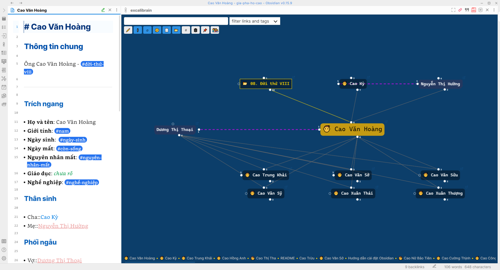
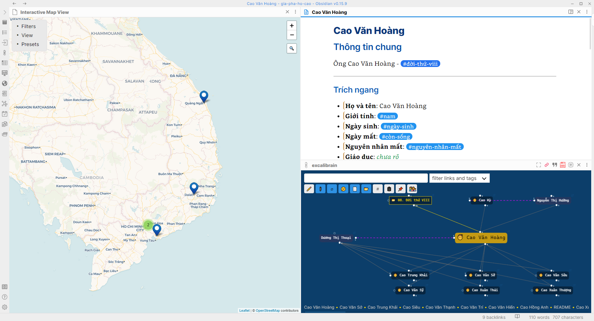
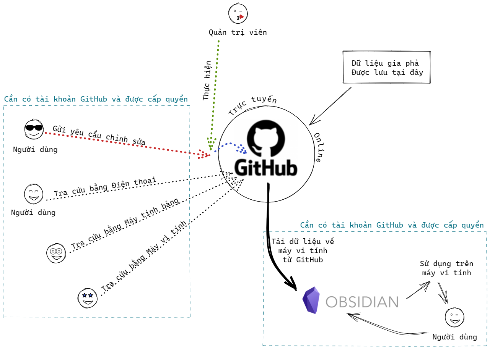

# Giải pháp số hóa

Số hóa gia phả không phải là điều mới mẻ và rất phổ biến. Có rất nhiều giải pháp số hóa nhưng do điều kiện của mỗi tộc họ là khác nhau nên giải pháp cũng cần phải khác nhau để phù hợp với điều kiện/kinh tế/hoàn cảnh lịch sử của mỗi tộc họ. Con xin được liệt kê các tiêu chí của giải pháp số hóa này như sau:

## Tiêu chí

### Về truy cập

- Truy cập mọi lúc, mọi nơi
- Truy cập trên mọi thiết bị *(điện thoại/máy tính bảng/máy vi tính)*

### Về bảo mật

- Có thể quyết định giới hạn truy cập, mức độ truy cập
- Có giải pháp đảm bảo toàn vẹn dữ liệu

### Về công nghệ

- Không phụ thuộc vào bất cứ công nghệ nào nhằm đảm bảo rằng dữ liệu sẽ luôn `sử dụng được`.

### Về chi phí

- Không phát sinh bất kì chi phí nào liên quan đến triển khai, bảo trì, và cập nhật

## Giải pháp

Từ những tiêu chí nêu trên, giải pháp được lựa chọn đó là sử dụng phần mềm **`Obsidian.md`** như là phần mềm chính để quản lý/khai thác dữ liệu gia phả trên máy vi tính và sử dụng **`GitHub`**.

Ưu điểm của giải pháp này là `100%` dữ liệu đều được lưu trữ dưới dạng `văn bản thuần` *(text only)* nên bất kì ai cũng có thể chỉnh sửa, bằng bất cứ công cụ nào. Khả năng tìm kiếm dữ liệu tự do. Chính vì vậy mà nó không phụ thuộc vào bất cứ công nghệ nào, phần mềm nào cả.

- **Obsidian** chỉ là công cụ **hỗ trợ**
- **GitHub** là phương tiện **lưu trữ** và **truy cập**.

### Github - https://github.com

GitHub là một dịch vụ cung cấp kho lưu trữ mã nguồn Git dựa trên nền web cho các dự án phát triển phần mềm. GitHub cung cấp cả phiên bản trả tiền lẫn miễn phí cho các tài khoản. Các dự án mã nguồn mở sẽ được cung cấp kho lưu trữ miễn phí.

Việc ứng dụng GitHub giúp chúng ta có thể làm được các công việc sau:

- Lưu trữ tập trung dữ liệu gia phả
- Các hoạt động cập nhật dữ liệu đều được lưu vết giúp kiểm soát mọi thay đổi *(version control)*
- Cập nhật dữ liệu theo quy trình phát triển phần mềm, cụ thể: để chỉnh sửa thì cần trải qua (1) người sửa, (2) kiểm duyệt *(approval)*
- Truy cập và tra cứu thông tin gia phả trực tiếp nên nền web nên có thể dùng bất cứ điện thoại/máy tính bảng/máy vi tính nào.. mà không cần phải cài đặt bất cứ gì cả. Có thể làm được điều này vì toàn bộ dữ liệu gia phả đều được lưu trữ dưới dạng văn bản thuần *(plain text)*.

### Obsidian - https://obsidian.md

Obsidian đơn giản chỉ là một `phần mềm ghi chú`, giúp người dùng quản lý các ghi chú/thông tin của mình trên máy vi tính dưới dạng văn bản thuần *(plain text)*. Chương trình này có thiết kế rất đặc biệt, được rất nhiều người hưởng ứng sử dụng, kéo theo rất nhiều lập trình viên tham gia viết các tính năng mở rộng cho nó. Vì thế, cho đến nay, `Obsidian` trở thành một ứng dụng quản lý kiến thức *(personal knowledge management)*, đôi khi được gọi là **"Your second brain"** *(bộ não thứ 2 của bạn)*.

Dữ liệu Gia phả bản chất cũng là những ghi chú có cấu trúc, có mối quan hệ qua lại lẫn nhau. Vì thế, việc áp dụng **Obsidian** vào quản lý và xây dựng dữ liệu gia phả là `một hình thức ứng dụng riêng` của Obsidian.

Mọi người nếu có điều kiện thì có thể sử dụng **Obsidian** để quản lý thông tin/kiến thức của bản thân **(học tập, nghiên cứu)** trong mọi lĩnh vực.

Nhờ vào các tính năng mở rộng của Obsidian, chúng ta sẽ có được các tính năng sau đối với quản lý gia phả:

- Tự động dựng `bản đồ mối quan hệ`

- Bản đồ địa lý để quản lý và tra cứu địa chỉ của tộc nhân.

### Mô hình hoạt động

Có thể tóm tắt mô hình hoạt động như sau. 

- Dữ liệu gia phả được lưu trực tuyến tại **`github.com`**.

- Bất cứ ai muốn tra cứu nhanh thì tra cứu trực tiếp trên GitHub.com

- Muốn nghiên cứu trực quan, thì có thể tải dữ liệu gia phả từ **GitHub** về máy và dùng phần mềm **Obsidian** để tra cứu.

:::info

Tra cứu/xem thông tin gia phải thì cần có [tài khoản GitHub](/tra-cuu-online/tao-tai-khoan) *(tạo miễn phí)*.

:::