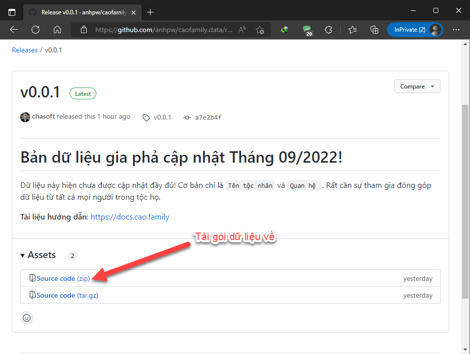

# Cài đặt

Phần mềm **`Obsidian`** có đủ các bản cài đặt trên mọi nền tảng `Windows`, `MacOS`, và `Linux`. Thậm chí có thể chạy trên mọi thiết bị điện thoại thông minh `Android`/`iPhone`.

## Cài đặt Obsidian

Truy cập trang chủ **`https://obsidian.md`** và chọn bản cài đặt phù hợp với hệ điều hành mà bạn đang muốn cài đặt. Ở đây sẽ chủ yếu là Windows hoặc MacOS.

<div style={{textAlign: 'center'}}>


</div>

Sau khi tải và cài đặt, hãy tải dữ liệu gia phả về để tra cứu.

## Tải dữ liệu gia phả

Để tại được dữ liệu gia phả, bạn cần có [tài khoản GitHub](/tra-cuu-online/tao-tai-khoan) và được [cấp quyền truy cập](/tra-cuu-online/cap-quyen-truy-cap).

- **Bước 1**: *Truy cập* địa chỉ [https://github.com/anhpw/caofamily.data](https://github.com/anhpw/caofamily.data)

- **Bước 2**: *Tải* gói dữ liệu **Releases**

- **Bước 3**: *Giải nén* vào 1 thư mục nào đó

- **Bước 4**: *Chạy* chương trình `Obsidian` lên và *mở* thư mục đó lên

<details>
<summary>Hình minh họa cho các bước</summary>

Truy cập Github và tải gói dữ liệu

<div style={{textAlign: 'center'}}>


</div>

<div style={{textAlign: 'center'}}>



</div>

Mở file Zip vừa download và giải nén về máy tính

<div style={{textAlign: 'center'}}>


</div>

<div style={{textAlign: 'center'}}>


</div>

Chạy Obsidian lên và mở thư mục vừa giải nén xong

<div style={{textAlign: 'center'}}>


</div>

<div style={{textAlign: 'center'}}>


</div>

Khi vừa dùng Obsidian mở thư mục dữ liệu gia phả, bạn cần xác nhân tin tưởng nội dung thư mục.

<div style={{textAlign: 'center'}}>


</div>

</details>

:::warning

Tiếp theo sẽ có một số **`vấn đề nhỏ`** phát sinh cho lần đầu tiên mở thư mục dữ liệu Gia phả. Hãy xem video minh họa phía dưới để biết cách xử lý.

:::

## Khởi chạy Obsidian lần đầu

```mdx-code-block
import LiteYouTubeEmbed from 'react-lite-youtube-embed';

<div className="video-container">
  <LiteYouTubeEmbed
    id="mmp6ld8IbkY"
    playlist={false}
    title="Lần đầu chạy Obsidian đọc dữ liệu gia phả"
    poster="hqdefault"
    noCookie={true}
  />
</div>

```
