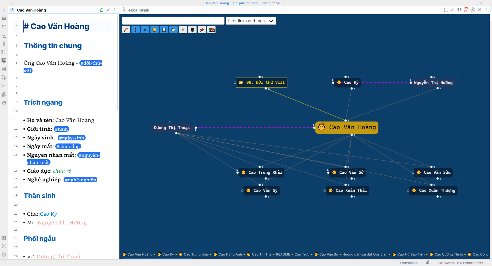
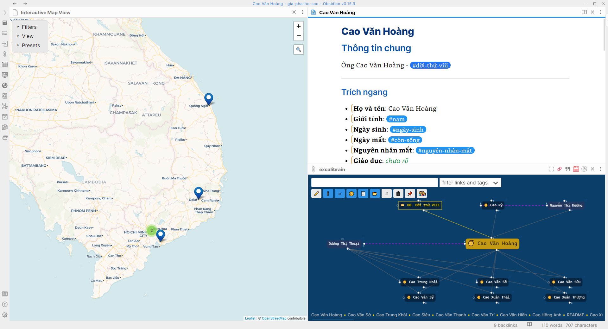

# Tổng quan

Phần này sẽ giới thiệu toàn bộ các tính năng mà Obsidian cung cấp trong giải pháp truy vấn dữ liệu số hóa gia phả, đi kèm là các khái niệm được sử dụng.

## Cấu trúc lưu trữ

- Thông tin mỗi tộc nhân sẽ được lưu trữ trong 1 tập tin văn bản duy nhất dưới định dạng văn bản thuần `(plain text)`.

- Các tập tin sẽ được lưu trữ vào các thư mục theo nguyên tắc đơn giản sau:

	- Tất cả tộc nhân cùng 1 đời sẽ được vào cùng 1 thư mục. Ví dụ: có các thư mục `01. Đời thứ I`, `02. Đời thứ II`, ..., `09. Đời thứ IX`, `09. Đời thứ X`, ...

	- Tộc nhân mang họ Cao sẽ nàm ở thư mục tương ứng. Tộc nhân không mang họ Cao sẽ nằm ở thư mục con mang tên là `Ngoại`

	<details>
	<summary>Hình minh họa</summary>

	<div style={{textAlign: 'center'}}>

	

	</div>

	</details>

## Cấu trúc dữ liệu

Mặc dù thông tin của tộc nhân được lưu trữ dưới dạng văn bản thuần nhưng nhờ công nghệ ghi chú `Markdown` và các quy tắc về `từ khóa` nên dữ liệu sẽ được **Obsidian** nhận diện và xử lý, cuối cùng đem lại những tính năng hấp dẫn về `Tìm kiếm`, `truy vấn` và thể hiện thành các hình thức đồ họa như `bản đồ địa lý`, `bản đồ mối quan hệ`.

**Cụ thể:**

1. Mã hóa các dữ liệu mang tính chất chung dưới dạng **`Thẻ`** hay tiếng Anh gọi là **`tags`**.

	Tag bắt đầu bằng ký tự `#`. Ta có thể tạo bất cứ thẻ nào. Hiện tại có các thẻ như:
	
	- `#nam`, `#nữ`  ==> giúp Obsidian phân biệt ai là nam, ai là nữ

	- `#năm-sinh-1986` ==> giúp Obsidian tìm những tộc nhân sinh trong năm 1986.

	- ..v.v.

2. Mã hóa quan hệ huyết thống qua các từ khóa `Cha::`, `Mẹ::`, `Vợ::`, `Chồng::`, `Con::`

	Nhờ những từ khóa này mà Obsidian vẽ nên được `bản đồ mối quan hệ`

3. Dữ liệu khác, được ghi chú bằng kỹ thuật `frontmatter`. Ví dụ như dữ liệu về địa lý sẽ được ghi vào đầu tập tin như sau:

```
	---
	location: [15.140761379735004,108.78409445285799]
	---
```

Rất đơn giản, phải không nào?! Nhờ thông tin này mà Obsidian đánh dấu được **địa điểm** của tộc nhân trên `bản đồ địa lý`.


## Một số hình minh họa

<details>
<summary>Bản đồ mối quan hệ</summary>

<div style={{textAlign: 'center'}}>



</div>

</details>

<details>
<summary>Bản đồ địa lý</summary>

<div style={{textAlign: 'center'}}>



</div>

</details>