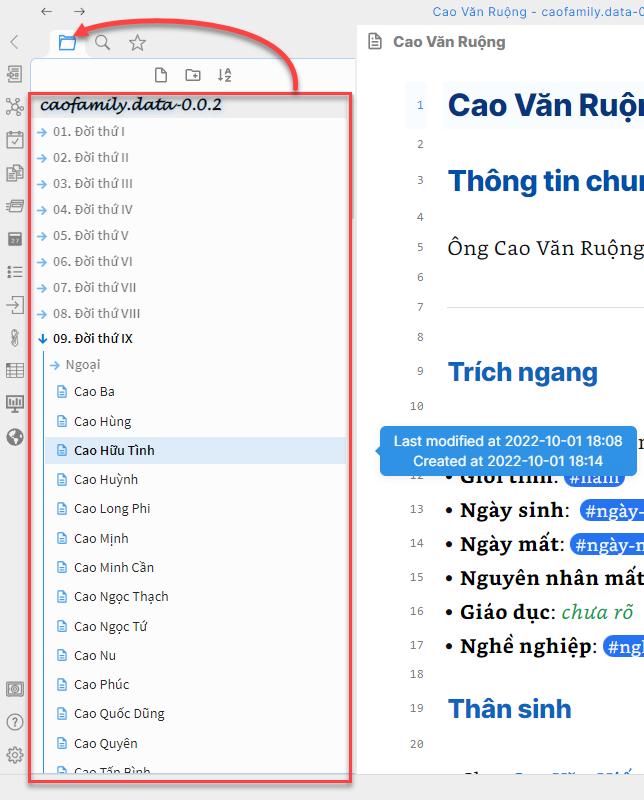
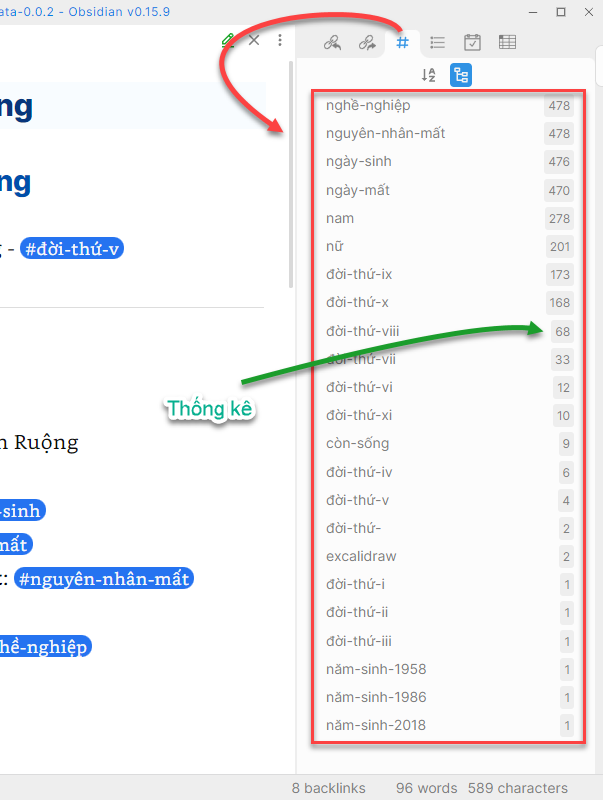
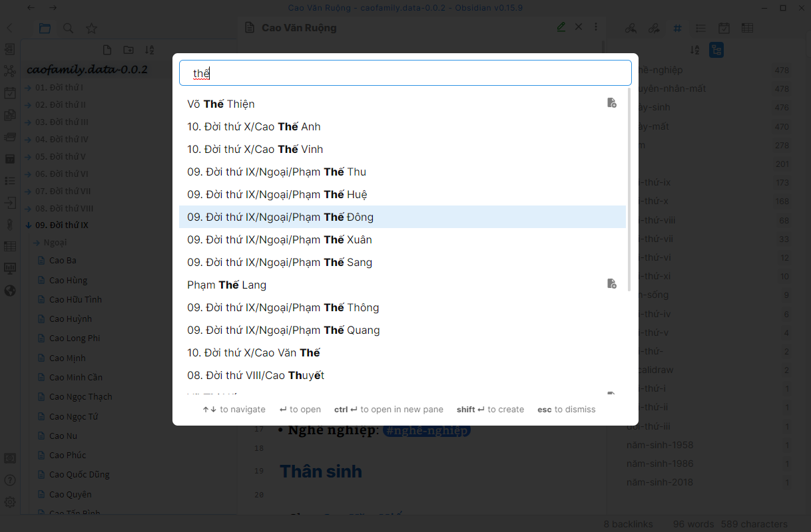
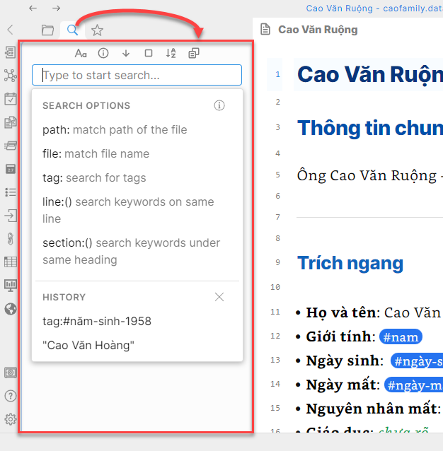
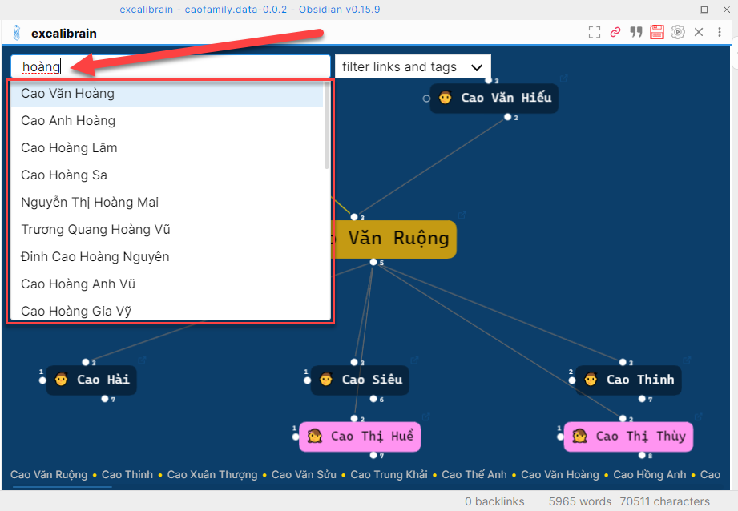
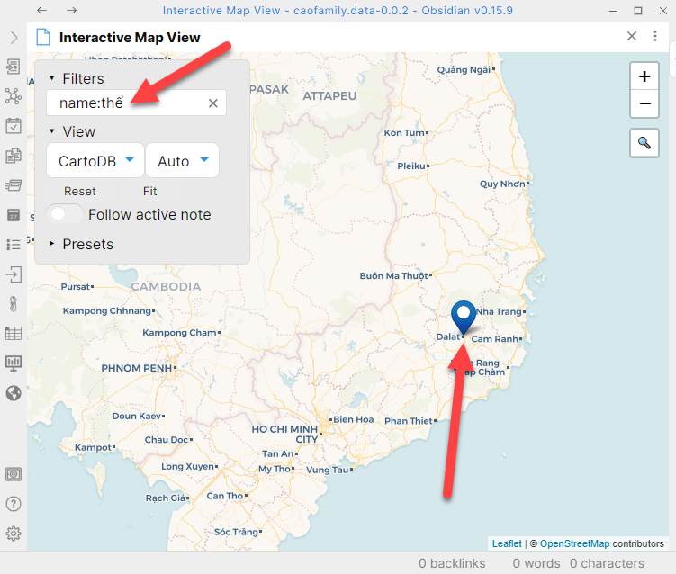

# Tra cứu

Obsidian và các tính năng mở rộng hỗ trợ rất nhiều hình thức tra cứu thông tin khác nhau. Giúp mọi người thoải mái tìm kiếm từ bất kì vị trí nào trên phần mềm.

## Cây thư mục

Bạn có thể tìm kiếm thông tin tộc nhân bằng cách chọn tập tin của tộc nhân đó trực tiếp ở cây thư mục bên trái màn hình.

## Thẻ/Nhãn thông tin

Bạn có thể tìm kiếm nhanh các tộc nhân thông qua các `thẻ` **(tags)** đã nhập liệu. Ví dụ: `#nam`, `#nữ`, `#năm-sinh-1986`,...v.v

## Phím tắt `Ctrl + O`

Hoặc một cách cực kì nhanh chóng là bấm tổ hợp phím **`Ctrl + O`**, một cửa sổ nhỏ hiện ra giữ màn hình và bạn có thể gõ tên của bất kì ai. Kết quả sẽ được liệt kê ngay lập tức.

## Tìm kiếm của Obsidian

Chức năng tìm kiếm của Obsidian rất mạnh mẽ. Bạn cần họ các cấu trúc của nó, và khi đó bạn thực hiện được rất nhiều lệnh phức hợp. Tạm thời tài liệu này chưa trình bày vì nó không đơn giản. Nếu quan tâm, hãy tham khảo hướng dẫn tại https://help.obsidian.md/Plugins/Search.

## Tìm kiếm của `Bản đồ quan hệ`

Tìm kiếm trực tiếp tại `bản đồ quan hệ` rất thú vị. Bạn hãy trải nghiệm bằng cách gõ tên của bất kì ai. Không cần gõ tên đầy đủ. **Ví dụ**: chỉ cần gõ `hoàng` là đủ.

## Tìm kiếm của `Bản đồ địa lý`

Tìm kiếm trực tiếp tại `bản đồ quan hệ` rất thú vị. Bạn hãy trải nghiệm bằng cách gõ tên của bất kì ai. Không cần gõ tên đầy đủ. **Ví dụ**: chỉ cần gõ `hoàng` là đủ.

