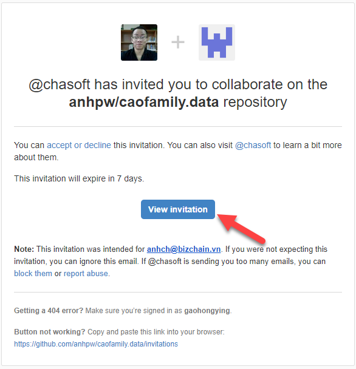
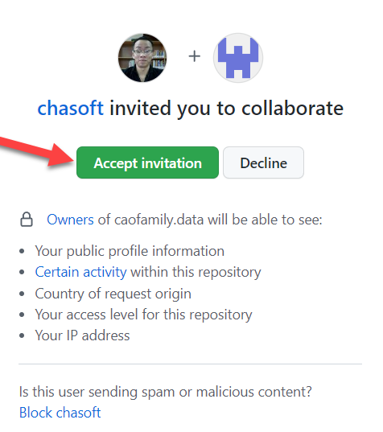
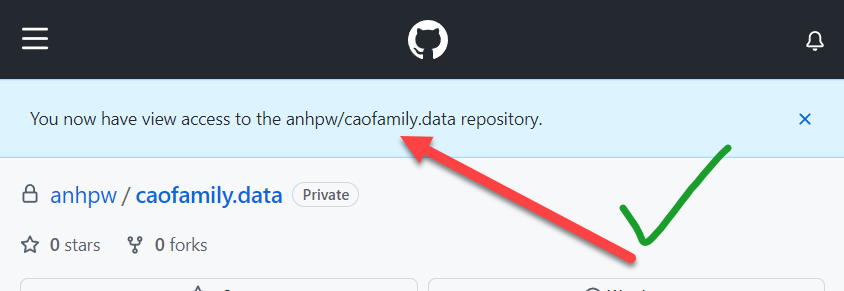

# Cấp quyền truy cập

## Yêu cầu cấp quyền

Gửi `username` của tài khoản vào nhóm Zalo **`CAO TỔ ĐÔNG DƯƠNG`** và yêu cầu cấp quyền truy cập dữ liệu gia phả. Mục đích này nhằm công khai tất cả các tài khoản được truy cập, tránh cấp nhầm cho người lạ.

## Cấp quyền truy cập

Sau khi **`Quản trị viên`** cấp quyền cho tài khoản xong. Bạn sẽ nhận được 1 email là lời mời tham gia cộng tác cho **`anhpw/caofamily.data`** *(đây là cơ sở dữ liệu gia phả)*.

Nhấp vào nút **`View Invitation`** thì sẽ mở trang web như bên dưới. Sau đó, Nhấp nút **`Accept Invitation`**

Và hệ thống sẽ **thông báo thành công** như sau:

:::info

Sau khi được cấp quyền truy cập thành công, hãy truy cập cơ sở dữ liệu gia phả tại địa chỉ: **`https://github.com/anhpw/caofamily.data`**

:::