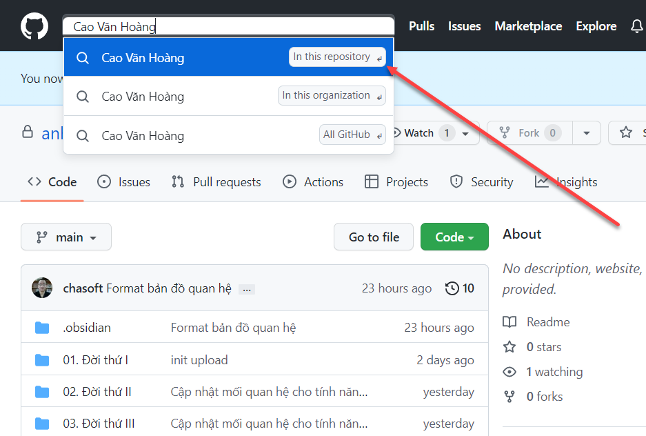
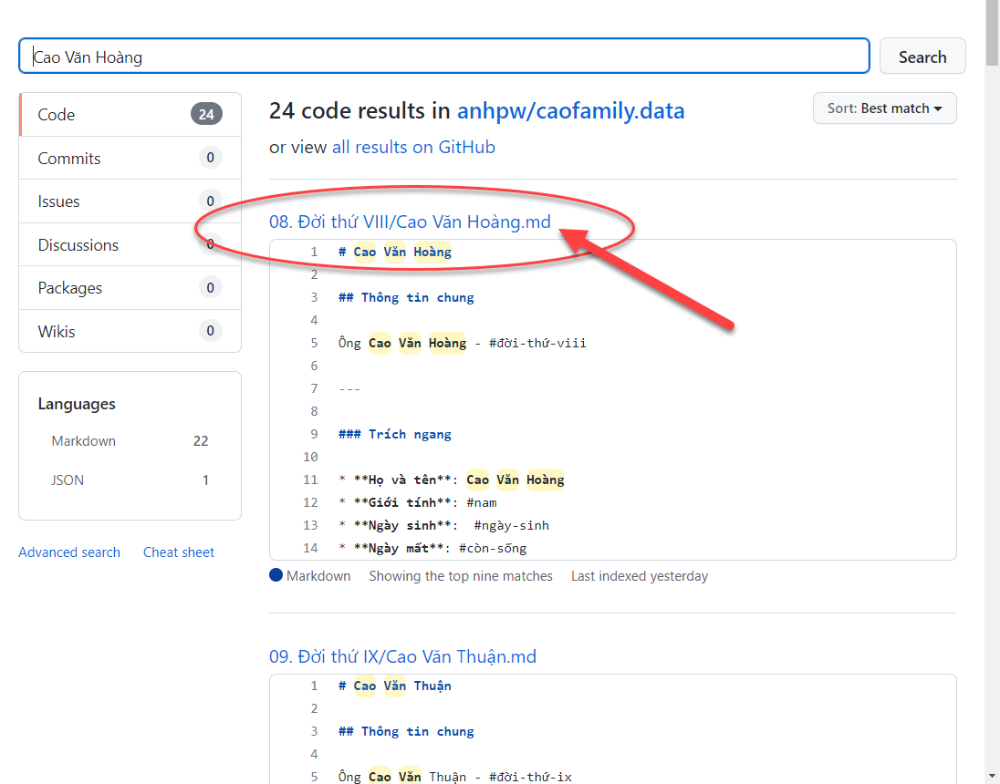
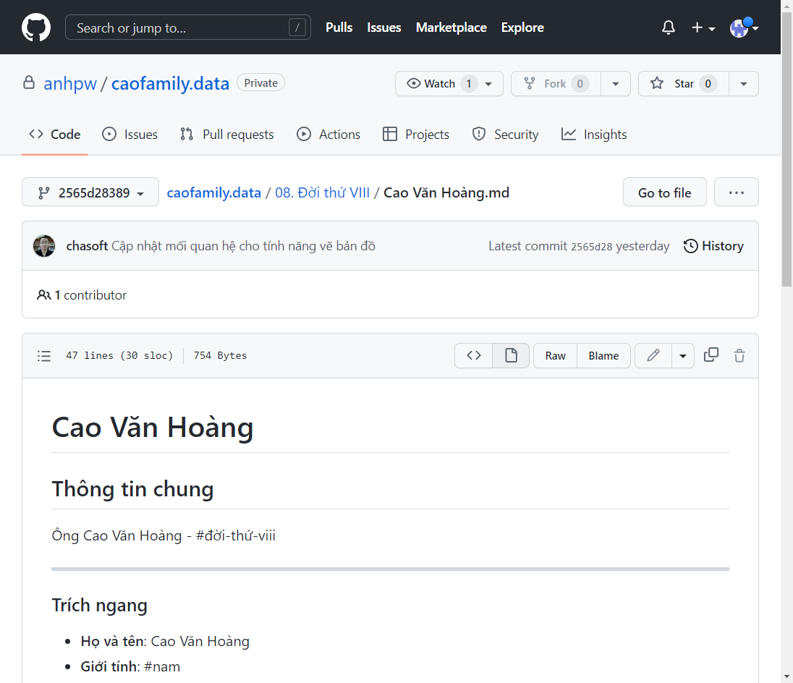
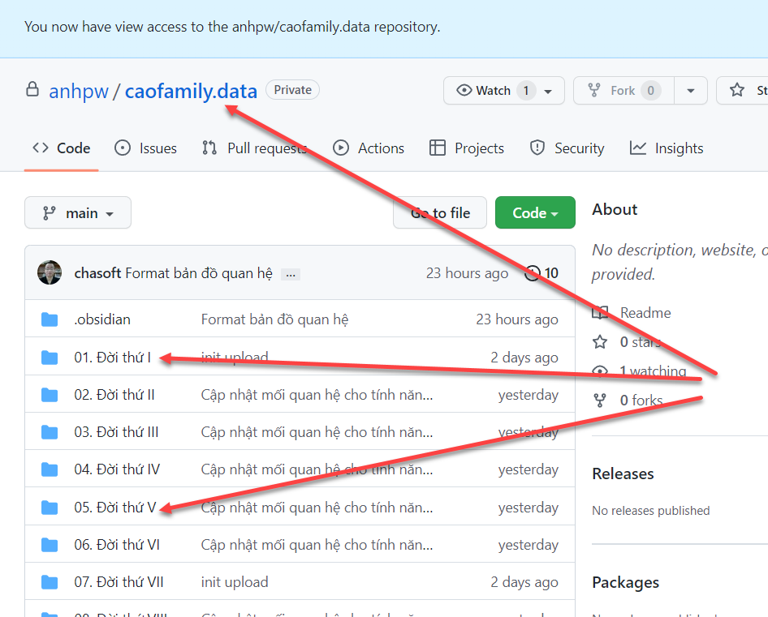

# Sử dụng GitHub

## Sử dụng GitHub

### Tìm kiếm

Việc sử dụng GitHub vô cùng đơn giản. Muốn tìm gì thì gõ đúng cái cần tìm và phải viết `tiếng Việt có dấu`.

:::info

| Nội dung cần tìm | Phù hợp |
|:---------------- |:-------:|
| Cao Văn Hoàng    |    ✔    |
| cao văn hoàng    |    ✔    |
| cao van hoang    |   ❌    |

:::

### Kết quả tìm kiếm

### Xem thông tin tộc nhân

Dữ liệu hoàn toàn là văn bản thuần *(plain text)* nên xem là nắm bắt nội dung ngay lập tức.

## Khám phá cơ sở dữ liệu gia phả

Ngoài việc tiềm kiếm thông tin trực tiếp, bạn có thể khám phá cơ sở dữ liệu gia phả bằng cách truy cập vào các liên kết trên Github.

