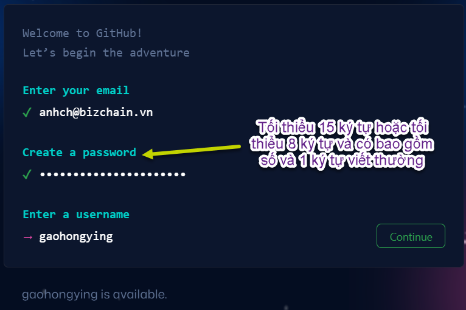
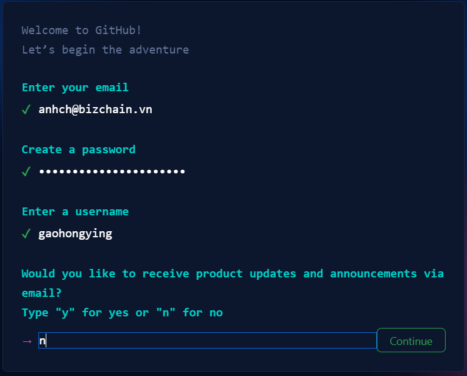
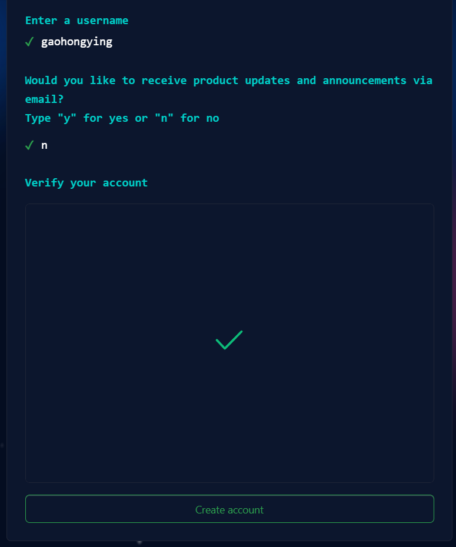
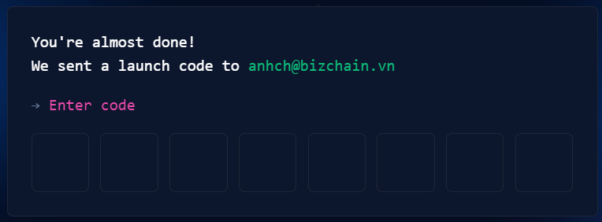
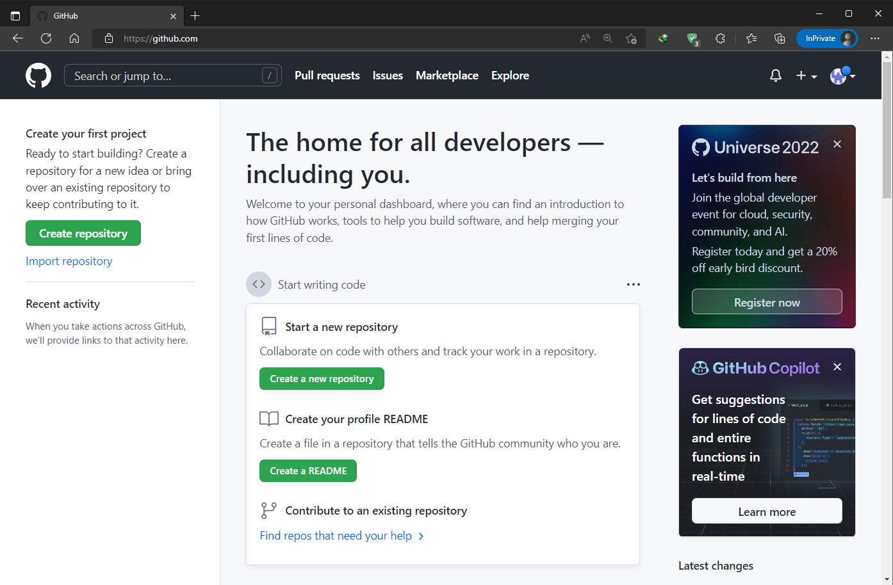

# Tạo tài khoản

## Tạo tài khoản

Tài khoản GitHub là hoàn toàn **`miễn phí`**. Truy cập vào địa chỉ **https://github.com/signup** sau để bắt đầu tạo một tài khoản GitHub mới. Các thông tin cần khai báo để tạo tài khoản gồm:

- **Địa chỉ email**
- **Mật khẩu**

- **Username** *(tên tài khoản)*

	:::info

	Username này rất quan trọng, nó sẽ là địa chỉ của bạn tại GitHub. Và địa chỉ đó sẽ có dạng như sau: `https://github.com/username`

	:::

## Hình minh họa 

Và trong hình minh họa trên, hãy nhập chữ `n`, *nghĩa là không nhận email quảng cáo/khuyến mãi*. 

Hệ thống có yêu cầu giải quyết một câu đố đơn giản. Nếu không rành tiếng Anh thì khi tạo tài khoản, nên có ai đó biết tiếng Anh hỗ trợ vì câu hỏi bằng tiếng Anh.

Sau đó, hệ thống sẽ gửi một mật mã về email được dùng ở trên.

Truy cập email về lấy mật mã này về.

Và khi **`đăng ký thành công`** thì trang web Github sẽ trả về màn hình như sau:

:::info

Truy cập trang Profile trên GitHub.

:::

## Những lưu ý khi tạo tài khoản

### Vấn đề tiếng Anh

:::info

Hệ thống có yêu cầu giải quyết một câu đố *(simple puzzle)* đơn giản. Nếu không rành tiếng Anh thì khi tạo tài khoản, nên có ai đó biết tiếng Anh hỗ trợ vì câu hỏi bằng tiếng Anh.

:::

### Yêu cầu đặt mật khẩu

:::info

Mật khẩu tối thiểu `15 ký tự` hoặc tối thiểu `8 ký tự` nhưng `có bao gồm số và 1 ký tự viết thường`.

:::